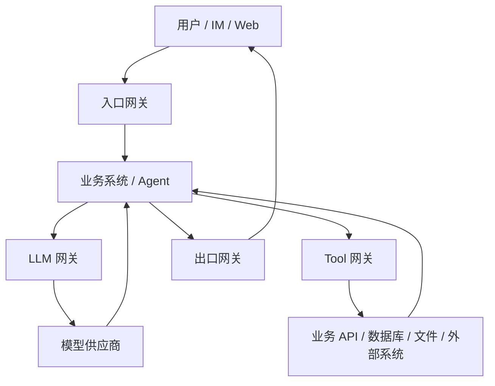
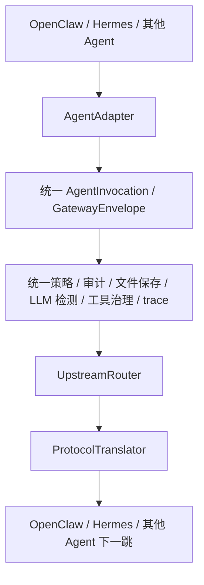
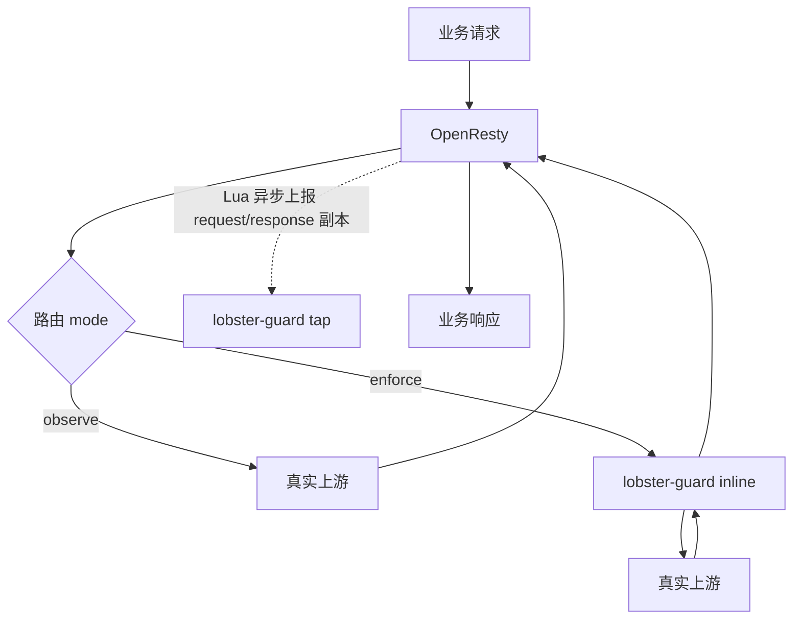
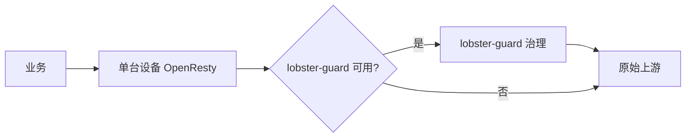
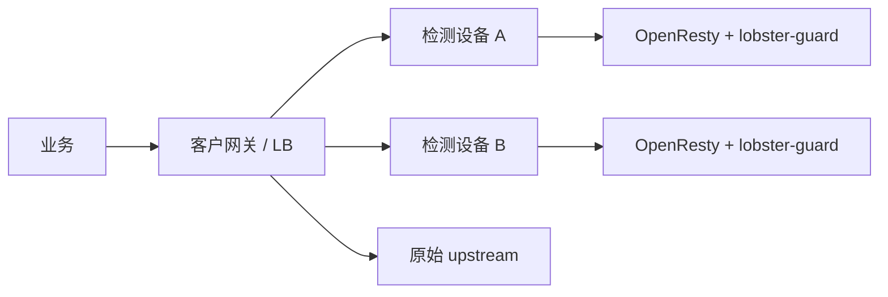
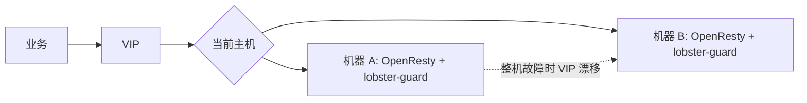
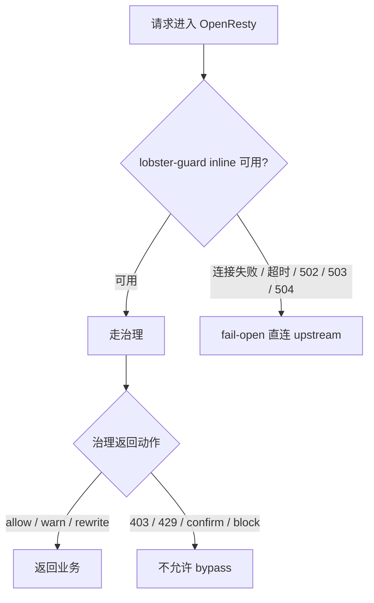
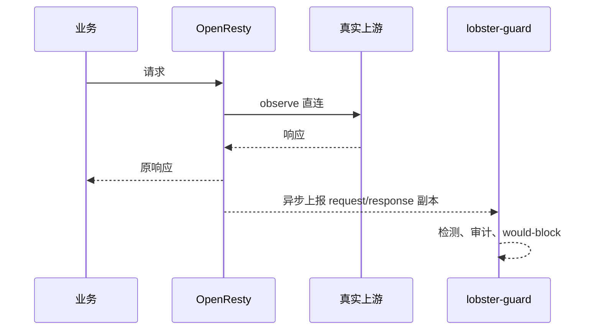
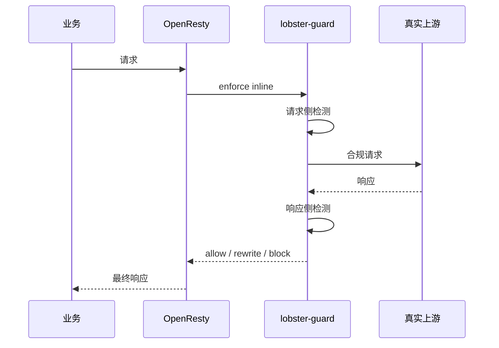

# AI 智能网关设计

本文用于说明 AI 智能网关的目标、边界、接入方式、客户现场部署方案和后续开发落点。它不是完整配置手册；字段和接口只保留足够指导汇报、方案评审和研发落地的最小模型。

能力状态约定：

| 标记 | 含义 |
|---|---|
| 当前已具备 | 项目已有对应基础能力，可复用或小幅调整 |
| 部署层能力 | 主要依赖 OpenResty、客户 LB、Ingress、DNS、证书等部署配置 |
| 建议新增 | 需要后续开发或补充部署模板 |

## 1. 设计目标

AI 智能网关的目标不是做一个覆盖所有 HTTP 流量的通用防火墙，而是治理完整的 AI 数据链路。它需要覆盖用户输入、业务系统、Agent、LLM、RAG、工具调用和最终外发内容，保证 AI 相关数据在进入模型、进入工具、返回用户之前都能被识别、审计和策略控制。

网关不应只拦截系统到 LLM 的 API 请求。真实风险往往出现在完整链路中：用户输入可能包含 prompt injection，业务系统拼接后的 prompt 可能引入越权上下文，RAG 检索可能返回不该被当前用户访问的数据，工具调用可能产生真实副作用，最终响应也可能泄露敏感信息。

普通业务流量默认走轻量治理：记录 trace、保存文件、抽取基础文本、做低成本风险识别。AI 相关流量进入深度治理：做 prompt injection、DLP、RAG 越权、工具越权、模型响应泄露等检测。

## 2. 总体架构



入口网关负责接收用户、IM、Web、API、文件上传等流量，进行身份识别、trace 生成、文件保存、基础检测和路由标注。对于未知业务接口，入口网关不假设自己能立即理解业务语义，而是先做轻量治理和 AI 相关性识别。

LLM 网关负责业务系统或 Agent 到模型供应商的请求和响应治理。这里必须看到完整 prompt，包括 system/developer/user messages、历史上下文、RAG 内容、工具定义、模型参数和流式响应。

Tool 网关负责 Agent 或业务系统调用工具、数据库、文件系统、内部 API、外部 API、邮件、IM 发送等动作。它重点治理真实副作用：读写数据、发送内容、执行命令、创建订单、修改权限、导出文件等。

出口网关负责业务系统或 Agent 返回给用户、IM、Web 的最终内容治理。它检查模型输出、工具结果、内部错误、敏感字段和外发动作结果，避免敏感信息或危险内容被直接返回。

## 3. 需要拦截的数据

| 数据类型 | 为什么要看 | 第一阶段处理 | 后续增强 |
|---|---|---|---|
| 用户输入 | prompt injection、越权意图、危险指令通常从这里进入 | 文本抽取、基础 DLP、trace、审计 | OCR、ASR、视频抽帧 |
| LLM 请求 | 业务拼接后的完整 prompt 才是真正决策输入 | 记录 messages、tools、model、参数、RAG 片段 | 语义检测、模型复核 |
| 上传文件 | 文件可能成为 RAG 或工具输入，后续需要审计和取证 | 保存原文或对象引用、hash、metadata | 病毒扫描、文档解析 |
| RAG 检索内容 | 检索结果可能跨租户、跨权限或高密级 | 记录 query、命中文档、标签、引用片段 | 权限校验、来源可信度 |
| 工具调用和结果 | 工具会产生真实副作用，风险高于普通文本 | 记录 tool name、参数、目标、结果、错误 | 能力边界、反事实验证 |
| 模型响应 | 可能泄露敏感信息、系统提示词或危险指导 | 响应 DLP、canary token、SSE 窗口检测 | 更细粒度 rewrite |
| 最终外发内容 | LLM 生成不等于业务执行，真正外发更关键 | IM/Web/邮件/API POST 审计和拦截 | 高危动作人工确认 |

边界：observe 模式下可以通过 OpenResty tap 获取响应副本并做审计，但不能阻止已经返回给业务的响应；需要实时 block/rewrite 时必须进入 enforce 模式。

## 4. 处理管线

所有入口都应归一成统一信封。统一信封是架构核心抽象，用来打通 IM、Web、Agent、LLM、工具和出口审计。

| 字段 | 含义 | 是否必需 | 生成方 | 用途 |
|---|---|---:|---|---|
| `tenant_id` | 租户或客户标识 | 是 | 网关、API Key、客户头 | 租户隔离、规则绑定 |
| `app_id` | 应用、Agent 或项目标识 | 是 | 接入配置、路由表 | 路由、审计、策略分组 |
| `user_id` | 真实用户或调用主体 | 建议 | IM 适配器、业务头、API Key | 用户画像、权限判断 |
| `session_id` | 会话或对话标识 | 建议 | 业务、Agent、网关推断 | 上下文串联 |
| `trace_id` | 单次链路追踪标识 | 是 | 网关生成或透传 | 全链路审计 |
| `source` | 流量来源，如 web、im、llm、tool | 是 | 适配器、路由 | 识别入口类型 |
| `direction` | 流量方向，如 app_to_llm、agent_to_tool | 是 | 适配器、路由 | 区分检测策略 |
| `content` | 抽取后的主要文本或结构化内容 | 是 | 适配器、解析器 | 检测输入 |
| `attachments` | 文件引用和 metadata | 可选 | 文件处理模块 | 文件审计、异步分析 |
| `tool_calls` | 工具调用结构 | 可选 | LLM/Agent 解析器 | 工具治理 |
| `metadata` | headers、path、method、status、upstream 等 | 是 | 网关、OpenResty tap | 审计和排障 |

快路径用于所有经过网关的流量，处理动作包括鉴权、租户识别、trace 生成、请求大小限制、文件保存、基础 DLP、关键词/正则/AC 自动机规则扫描、结构化审计和低成本风险标记。

深度路径只用于 AI 相关、高风险或已标注流量，处理动作包括 prompt injection 检测、RAG 越权判断、工具越权判断、敏感数据泄露检测、语义风险识别、模型复核、上下文污染识别、跨会话数据泄露识别和高危副作用确认。

策略动作不应只有 block。建议动作词如下：

| 动作 | 含义 | 常见使用位置 |
|---|---|---|
| `allow` | 明确放行 | 正常流量 |
| `log` | 只记录 | 低风险 observe |
| `warn` | 告警但放行 | 可疑输入、低置信检测 |
| `redact` | 脱敏字段 | 响应或外发内容 |
| `rewrite` | 改写请求或响应 | 响应修正、提示词缓解 |
| `review` | 进入人工审核 | 中高风险操作 |
| `confirm` | 执行前确认 | 高危工具或副作用动作 |
| `block` | 拒绝请求或响应 | 明确违规或高风险 |

## 5. 未知 Web/IM Agent 接口处理

OpenClaw、Hermes 这类已知协议 Agent 通常可以明确知道哪些 URL 用于接收消息、发送消息、调用 LLM、执行工具或管理会话。它们适合用明确适配器接入。

普通 Web 应用和自定义 IM Agent 不一定能提前知道哪个接口是收消息、哪个接口是发消息。有些业务所有请求都在一个通道里，有些接口名完全由用户自定义，有些响应内容由业务系统二次包装后返回。网关不能假设自己第一天就能自动理解所有业务接口。

对于这类未知协议，采用“全量轻量拦截 + AI 相关性识别 + 用户标注 + 旁路学习”的方案。

| 阶段 | 行为 | 是否阻断 | 输出 |
|---|---|---:|---|
| 全量轻量拦截 | 记录 trace、身份、path、method、content-type、大小、耗时、基础 DLP | 默认不阻断 | 基础审计和风险标记 |
| AI 相关性识别 | 根据请求/响应特征识别疑似 AI 接口 | 不阻断 | 疑似接口建议 |
| 用户标注 | 用户确认接口方向、字段抽取、会话字段、用户字段 | 不阻断 | 明确路由声明 |
| 深度治理 | 对确认后的 AI 链路应用深度策略 | 可阻断 | block/rewrite/confirm 等动作 |

AI 相关性识别可使用以下特征：`prompt`、`messages`、`model`、`tools`、`tool_calls`、`stream`、`input`、`question`、`content`、`conversation_id`、`session_id`、`multipart/form-data`、`text/event-stream`。还可以结合响应特征判断，例如返回大段自然语言、Markdown、代码块、流式 token、模型供应商风格字段、assistant/user/system 角色字段等。

用户标注只需要表达最小能力，不在本文展开完整配置语法：

| 标注项 | 用途 | 示例 |
|---|---|---|
| `path` | 标记业务接口 | `/api/chat` |
| `direction` | 标记链路方向 | `user_to_app`、`app_to_user`、`agent_to_tool` |
| `content_field` | 指定主要内容字段 | `messages[-1].content` |
| `user_field` | 指定用户字段 | `user.id` |
| `session_field` | 指定会话字段 | `conversation_id` |
| `file_field` | 指定上传文件字段 | `multipart.file` |

详细 JSONPath、字段抽取表达式和校验规则应放入配置文档，不放在本文展开。

## 6. OpenClaw 与 Hermes 接入

OpenClaw 和 Hermes 都需要把入口、LLM、工具、出口关键流量引入网关。区别只在协议和下一跳，不应该为每个 Agent 单独复制一套安全治理逻辑。



`AgentAdapter` 负责把不同 Agent 协议转成统一调用模型。OpenClaw、Hermes 或其他 Agent 的鉴权方式、请求路径、会话字段、文件字段、回调格式、流式协议，都在适配器中处理。

`UpstreamRouter` 负责选择下一跳。下一跳可以是 OpenClaw 实例、Hermes 实例、普通业务 Agent、模型代理或工具服务。路由可按租户、应用、用户、会话、Agent 类型、健康状态、负载和策略结果决定。

`ProtocolTranslator` 负责把统一处理结果转回目标 Agent 需要的协议格式。例如 OpenClaw 和 Hermes 可能需要不同的 HTTP body、headers、stream frame、回调响应或错误格式，这些差异由翻译层处理。

因此，不同 Agent 的协议适配和下一跳路由可以不同，但安全治理、审计、文件保存、策略决策和 trace 串联必须统一。新增 Agent 时，只新增适配器和协议翻译，不复制检测、审计和策略系统。

## 7. 流量引入方式

已知 Agent 适合明确配置入口、出口、LLM base_url 和工具出口。比如 OpenClaw、Hermes 这类 Agent，可以配置它们的接收消息 URL、发送消息 URL、模型调用地址和工具调用出口，让关键 AI 链路显式经过网关。

Web 应用可以通过 SDK/base_url、反向代理、Ingress 或 Sidecar 引入流量。业务系统调用 LLM 时，应强制把模型 base_url 指向 LLM 网关。用户到业务系统的入口可以先经过入口网关做轻量治理和 AI 接口识别。

IM 场景需要同时支持标准 API、webhook 和 bridge 长连接。标准 API 适用于 IM 内置 Web 服务或自定义 Agent 主动调用网关；webhook 适用于平台回调；bridge 适用于平台长连接推送或拉取消息。三者都应归一到统一信封。

DNS 或透明代理可以作为强管控补充，但不建议作为第一优先级。透明代理会引入 HTTPS 证书、TLS 终止、协议识别、误拦普通业务、排障复杂度等问题。第一阶段更推荐显式接入：SDK/base_url、Ingress、Sidecar、反向代理和 Agent 适配器。

核心策略是“URL/DNS 指向网关 + 网关持自有域名证书 + 网关作为客户端连接真实上游”。业务系统配合地把要治理的 URL 或域名指向网关：能改 base_url 的直接换地址，能改 DNS 的把自有业务域名解析到网关。由于被指向的是业务自有域名，网关持有该域名的合法证书即可，不需要劫持第三方域名、不需要 TLS MITM、不需要业务机额外信任伪造 CA。


这里说的“DNS 指向网关”是把业务自有域名的解析改成网关地址，属于显式接入，与透明代理劫持第三方域名不同。第三方性质只出现在“网关到真实模型供应商”那一段，而那段网关是普通 HTTPS 客户端，验证上游自己的真实证书，与网关自身的证书策略无关。

四位置的接入映射如下：

| 位置 | 业务侧改动 | 网关角色 | TLS 处理 |
|---|---|---|---|
| 入口（IM/Web 到业务） | 业务服务域名 DNS 或 LB 指向网关 | 反向代理 | 业务到网关用自有证书 |
| LLM 流（AI 核心） | LLM `base_url` 指向网关域名 | 反向代理 + 客户端 | 业务到网关用自有证书；网关到供应商正常 HTTPS |
| 出口（业务到 IM/用户） | IM API 域名 DNS 或出口代理指向网关 | 反向代理 + 客户端 | 同上 |
| 工具 | 通常不单独改 DNS | 通过 LLM 信封中的 `tool_calls` 覆盖 | 按具体工具出口决定 |

证书策略上，只需在“业务到网关”段持有证书；网关到上游段无需自备证书。不应通过关闭业务侧证书校验来绕过验证，否则会丢失服务端身份认证，与安全网关目标相悖。

项目接入时必须同步确认 HTTPS 证书边界。客户端校验证书时看的是用户实际访问的域名，也就是 TLS SNI/浏览器地址栏中的域名，而不是 DNS 最终解析到的网关域名。即使客户采用 `chat.customer.com CNAME gateway.vendor.com`，OpenResty 仍必须提供匹配 `chat.customer.com` 的证书；只提供 `gateway.vendor.com` 证书会导致客户端证书域名不匹配。

客户证书配合方式建议如下：

| 方式 | 推荐场景 | 客户需要提供 | 网关处理方式 | 注意事项 |
|---|---|---|---|---|
| 项目单独证书 | 不同项目、不同域名、不同安全边界 | 每个项目域名对应的证书和私钥 | OpenResty 按 SNI/Host 选择证书 | 最清晰，但证书数量和续期工作更多 |
| 客户通配符证书 | 多个项目都在同一客户主域下 | 如 `*.customer.com` 的证书和私钥 | 多个项目复用同一证书 | 通常只覆盖一级子域，不能覆盖 `a.b.customer.com` |
| 客户前置 LB 终止 TLS | 客户不愿交付私钥或已有统一入口 | LB 证书和转发配置由客户维护 | 我方网关接收内网 HTTP 或可解密的内网 HTTPS | 高可用和证书续期由客户入口承担 |

客户现场可用的流量引入方式按推荐程度排序如下：

| 推荐度 | 引入方式 | 适用场景 | 能否看请求/响应正文 | 客户配合程度 | 说明 |
|---|---|---|---|---|---|
| 高 | 客户已有网关/LB/API Gateway 转发 | 生产已有入口治理体系 | 能，前提是 TLS 在客户入口或我方入口合法终止 | 中 | 最少改业务，HA 由客户入口负责 |
| 高 | SDK/base_url/环境变量统一注入 | LLM 与 Agent 调用 | 能 | 低到中 | 覆盖 AI 核心链路，改动清晰 |
| 高 | Ingress/Gateway API/Service Mesh | Kubernetes 场景 | 能 | 中 | 用平台路由把流量导入网关 |
| 中 | DNS/CNAME 指向网关 | 自有域名、自有内网 DNS | 能，前提是网关持有访问域名证书 | 中 | 简单直接，但要维护 Host 到 upstream 映射和项目证书 |
| 中 | Egress Gateway/出口代理 | 统一外联 AI/API 出口 | 视 TLS 终止点而定 | 中到高 | 适合企业出口治理 |
| 低 | HTTP_PROXY/HTTPS_PROXY/PAC | 支持代理的客户端或办公终端 | HTTPS 正文依赖客户端信任代理证书 | 高 | 不作为服务端默认方案 |
| 低 | TProxy/iptables 透明代理 | 强管控补充 | 不 MITM 看不到 HTTPS 正文 | 高 | 只适合补充流量发现 |

### 7.1 边缘路由模型

无论采用 DNS、LB 转发、Ingress 还是出口网关，只要多个项目或多个域名都指向同一套网关，就必须维护一张边缘路由表，按 Host/SNI、Path、Method 找回原始 upstream。建议新增统一的 `edge_routes` 概念，由 lobster-guard 保存项目、域名、路径、模式和原始上游，OpenResty 使用本地缓存的路由表完成转发，避免网关进程异常时丢失 fail-open 能力。

最小字段如下：

| 字段 | 含义 | 是否必需 | 生成方 | 用途 |
|---|---|---:|---|---|
| `id` | 路由唯一标识 | 是 | 管理端或配置 | 审计、上报、路由引用 |
| `project_id` | 项目或应用标识 | 是 | 客户录入或管理端 | 多项目隔离和统计 |
| `hosts` | 匹配的 Host/SNI 列表 | 是 | 客户提供 | 多域名接入 |
| `path_prefix` | 路径前缀 | 是 | 客户提供 | 同域名下多路由 |
| `mode` | `observe` 或 `enforce` | 是 | 管理端 | 控制检测/拦截模式 |
| `upstream_url` | 原始上游地址 | 是 | 客户提供 | 正常转发与 fail-open |
| `host_policy` | Host 转发策略 | 建议 | 管理端 | 保留原 Host 或改写为 upstream Host |

示例只表达最小模型：

```yaml
edge_routes:
  - id: "proj-a-api"
    project_id: "project-a"
    hosts: ["api-a.customer.com"]
    path_prefix: "/"
    mode: "observe"
    upstream_url: "https://origin-a.internal"
    host_policy: "upstream_host"

  - id: "proj-b-llm"
    project_id: "project-b"
    hosts: ["llm-b.customer.com"]
    path_prefix: "/v1/"
    mode: "enforce"
    upstream_url: "https://api.anthropic.com"
    host_policy: "upstream_host"
```

匹配原则建议：

| 规则 | 建议 |
|---|---|
| Host 匹配 | 精确域名优先，通配域名次之；SNI 与 Host 不一致时以 HTTP Host 为准并记录异常 |
| Path 匹配 | 最长前缀优先 |
| Method 匹配 | 第一阶段可不作为必需条件，后续需要细分时再加 |
| 默认路由 | 不建议自动兜底到任意 upstream；未匹配应返回明确错误或走客户配置的安全默认策略 |
| 冲突校验 | 同一 Host + path_prefix 不允许出现多个同优先级路由 |

OpenResty 转发或上报时建议带内部头，但这些头不作为对外公共接口：

| 建议内部头 | 用途 |
|---|---|
| `X-Lobster-Route-ID` | 关联 edge route |
| `X-Lobster-Project-ID` | 关联项目 |
| `X-Lobster-Mode` | 标记 observe/enforce |
| `X-Original-Host` | 记录业务访问域名 |
| `X-Original-URI` | 记录原始路径和查询参数 |

生产上不建议每次请求动态查询 lobster-guard 决定 upstream。更稳的方式是 lobster-guard 管理路由表，OpenResty 周期拉取或由管理操作生成本地路由缓存，路由变更时 reload 或刷新 Lua shared dict。

## 8. 文件与多模态

第一版至少要保存文件原文，并记录 metadata、hash、大小、类型、来源、租户、应用、用户、会话和 trace。文件保存是后续审计、回放、异步分析、告警和取证的基础。

建议文件内容落到本地文件系统或对象存储，数据库只保存引用和 metadata。需要避免路径穿越，文件名应安全化，存储路径不直接信任用户输入。相同文件可以通过 hash 去重，但去重不能破坏不同 trace 与文件使用记录之间的关系。

图片、语音、视频、PDF、Office、压缩包等多模态内容第一阶段可以只保存和记录 metadata。OCR、ASR、视频抽帧、病毒扫描、文档解析、代码扫描、敏感信息识别都应作为异步能力逐步加入，不阻塞主请求链路。

对于大文件，主链路只完成上传限制、保存、hash、metadata 和基础策略判断。深度分析结果可以后续补充到风险画像、告警、审计和策略建议中。

## 9. 性能原则

网关必须区分快路径和慢路径。快路径覆盖所有流量，保证低延迟和稳定吞吐；慢路径只处理 AI 相关、高风险或已标注接口。

1000 QPS 场景下不能所有请求都做模型复核。模型复核、OCR、ASR、视频抽帧、深度语义分析和大文件解析都属于高成本能力，必须异步化、采样化或按策略触发。

LLM 出口和工具调用必须强治理。即使入口接口无法准确识别，只要业务系统到 LLM、Agent 到工具的关键路径经过网关，仍然可以看到完整 prompt、工具调用和真实副作用动作。

审计写入应结构化、批量化，并避免把大对象直接写入数据库。SSE 流式响应需要边流边做窗口检测，不能等完整响应结束才开始处理，也不能因为每个 token 都同步落库而拖垮性能。

最终设计原则是：协议适配和下一跳路由可以按 Agent 区分，但安全治理、审计、文件保存和策略决策必须统一。

## 10. 客户现场部署与 fail-open

inline 网关天然是单点故障：流量经过它，它挂了业务就受影响。任何在路径上的安全设备都有“强拦截”和“不挂业务”的矛盾，完美的“既强拦截又永不影响业务”不存在，只能靠分层降级把故障概率和影响压到最低。

客户现场默认推荐 OpenResty（Nginx + Lua）作为前置组件。原因是它既能保留 Nginx 的成熟反向代理、健康检查和 fail-open 语义，又能通过 Lua 在 observe 模式采集请求与响应副本。Envoy 能力更强但改造和运维成本更高；Traefik 插件可实现但生产插件生命周期和 fail-open 配置不如 OpenResty 直观；HAProxy 更适合纯 LB，不适合响应体 tap。



OpenResty 的 fail-open 只应在连接失败、超时、无效响应头、502、503、504 这类网关不可用场景触发，不能因为 lobster-guard 返回 403、429、confirm 等安全策略结果而绕过网关。否则攻击请求会通过“触发拦截”反而进入 bypass。

### 10.1 推荐结论

| 推荐场景 | 推荐方案 | 推荐度 | 原因 | 主要限制 |
|---|---|---:|---|---|
| PoC/试点、客户先给一台设备 | 单台 OpenResty 自动 fail-open | 高 | 最容易落地，能验证核心治理能力 | 不防 OpenResty 或整机故障 |
| 生产环境、客户已有入口网关/LB | 客户网关/LB 托管 HA | 高 | 责任边界清楚，符合企业运维体系 | 依赖客户入口配置能力 |
| 私有机房、两台同二层物理机 | keepalived + VRRP + ARP 漂移 | 中 | 可防整机故障 | 要求同二层、VRRP、ARP |

### 10.2 方案二：单台设备 OpenResty 自动 fail-open（PoC/试点推荐）

推荐度：高，适合 PoC、试点和客户先给一台设备的场景。它解决的是 lobster-guard 业务进程异常时业务不中断，但不解决 OpenResty 或整机故障。



| 项目 | 说明 |
|---|---|
| 实现方式 | OpenResty 终止 TLS，按 `edge_routes` 找到 route、mode 和 upstream；observe 直连上游并异步 tap；enforce 转给 lobster-guard inline |
| 部署方式 | 一台客户设备部署 OpenResty、lobster-guard、数据库或数据库连接配置 |
| 客户配合 | 提供域名、路径、原始 upstream、证书；将流量通过 DNS、base_url、已有 LB、Ingress 或出口网关导到设备 |
| 不能解决 | OpenResty 挂、设备整机挂、客户网络到设备不可达 |

### 10.3 方案三：客户已有网关/LB 托管高可用（生产推荐）

推荐度：高，适合客户已有 F5、Nginx、API Gateway、WAF、SLB、Ingress、Service Mesh 或其他统一入口的生产环境。高可用责任边界最清楚，也最符合企业运维规范。



| 项目 | 说明 |
|---|---|
| 实现方式 | 客户网关/LB 做设备级健康检查和故障切换，我方 OpenResty 做设备内 lobster-guard 进程级 fail-open |
| 部署方式 | 至少一台检测设备；生产建议两台或多台；客户网关按域名、路径或项目转发 |
| 客户配合 | 提供前置网关配置权限或由客户运维配置；提供原始 upstream、证书、健康检查、超时和重试策略 |
| 不能解决 | 客户入口本身不可用；客户策略不允许所有检测设备失败后直连时，业务可能返回错误 |

健康检查建议：

| 端点 | 建议暴露方 | 含义 |
|---|---|---|
| `/readyz` | OpenResty | 入口可接流量，且本地路由缓存可用 |
| `/healthz` | lobster-guard | 管理面、数据库、引擎和上游概览 |

客户网关 fail-open 规则必须区分“设备不可用”和“安全策略返回”：连接失败、超时、502、503、504 可切换；403、429、confirm 不应切换。

### 10.4 方案一：两台物理机 keepalived + VRRP + ARP 漂移（私有机房推荐）

推荐度：中，适合客户提供两台物理机或同二层网络设备，并允许 VIP 漂移的私有机房场景。它可以解决整机故障，但网络前提最多；普通云主机不应默认采用纯 keepalived/VRRP。



| 项目 | 说明 |
|---|---|
| 实现方式 | 两台机器均部署 OpenResty + lobster-guard；keepalived 使用 VRRP 做主备心跳；VIP 同一时间只绑定在一台机器上 |
| 部署方式 | DNS 将网关域名解析到 VIP；两台机器配置相同的 `edge_routes`、证书、OpenResty 规则和 lobster-guard 配置 |
| 客户配合 | 两台设备必须在同一二层网络/VLAN；网络允许 VRRP 和 gratuitous ARP；提供 VIP、真实 IP、网卡、网段、证书、原始 upstream |
| 不能解决 | 不适用于大多数普通云主机；两台设备都不可用时无入口 |

keepalived 的 `track_script` 建议检查 OpenResty 是否能接流量，而不是只检查机器存活；lobster-guard 异常由 OpenResty fail-open 处理，不一定触发 VIP 漂移。云主机环境如需同类能力，应优先使用客户云厂商的托管 LB、Floating IP、HaVip 或 GSLB，而不是默认纯 VRRP。

### 10.5 故障处理边界



| 故障 | 方案二处理 | 方案三处理 | 方案一处理 |
|---|---|---|---|
| lobster-guard 挂 | OpenResty 自动直连 upstream | 本机 OpenResty 自动直连 upstream，或客户 LB 切设备 | 本机 OpenResty 自动直连 upstream |
| OpenResty 挂 | 需要外部或人工切换 | 客户 LB 摘除该设备 | keepalived 漂移 VIP |
| 整机挂 | 需要外部或人工切换 | 客户 LB 摘除该设备 | keepalived 漂移 VIP |
| 两台检测设备都不可用 | 不适用 | 按客户策略直连 upstream 或返回错误 | 无入口，除非客户还有外部 LB |
| 真实 upstream 挂 | 返回 upstream 错误 | 返回 upstream 错误 | 返回 upstream 错误 |

fail-open 意味着故障期不再检查，因此要补三件事：故障期告警、记录哪些流量绕过了网关、尽量靠多实例把故障窗口压短。除 fail-open 外，还应配套网关内部降级和快路径超时熔断。

| 降级层次 | 防的故障 | 故障期能否 enforce | 能力来源 |
|---|---|---:|---|
| HA 多实例 + LB | 单实例挂 | 能 | 部署层能力 |
| LB 级 fail-open | 整个网关不可用 | 不能 | 部署层能力 |
| 网关内部降级透传 | DB/引擎异常 | 部分不能 | 建议新增/已有基础 |
| 超时熔断透传 | 检测拖慢请求 | 超时后不能 | 建议新增/已有基础 |
| tap/旁路审计 | 不想 inline、零风险上线 | 不能 | OpenResty + tap 端点 |

## 11. 检测/拦截双模式

网关可以运行在两种模式：检测模式（observe，只审计告警、不拦）和拦截模式（enforce，真 block/rewrite）。关键设计是：检测和拦截不是两套系统，网关复用同一套检测、审计和策略逻辑；区别在于流量是否经过 inline proxy，以及 OpenResty 是否采用网关的阻断/改写结果。

### 11.1 模式对比

| 维度 | observe（检测/tap） | enforce（拦截/inline） |
|---|---|---|
| 是否在主链路 | lobster-guard 不在主链路，OpenResty 直连上游 | lobster-guard 在主链路 |
| 能否拦截 | 不能，只记录 would-block | 能，支持 block/rewrite/confirm |
| 能否看请求 | 能，OpenResty Lua tap 上报副本 | 能，inline 请求经过网关 |
| 能否看响应 | 能看到副本，但不能阻止已返回内容 | 能，且可实时拦截或改写 |
| 网关失败影响 | 停止观测，业务继续 | 依赖第 10 节 fail-open |
| 适用阶段 | 新接入、旁路学习、误报评估 | 稳定路由、高风险链路、强治理 |





### 11.2 tap 数据流

observe 模式下，OpenResty 负责复制 request/response 副本并异步上报到 tap ingest 端点。网关收到的是一次 exchange 记录，不是原始业务请求本身，因此绝不能再 forward 上游。

| 数据 | 采集点 | 默认限制 | 用途 |
|---|---|---|---|
| 请求头/方法/路径 | `access_by_lua` | 敏感头脱敏 | 路由、身份、审计 |
| 请求体 | `access_by_lua` | preview 截断 + hash | prompt、参数、DLP |
| 响应状态/响应头 | `header_filter_by_lua` | 敏感头脱敏 | 响应审计 |
| 响应体 | `body_filter_by_lua` | preview 截断、大响应 hash/采样 | 响应 DLP、canary |
| 上报动作 | `log_by_lua` 或 timer | 异步、限队列、失败不阻塞 | 审计和 would-block |

OpenResty tap 默认约束：

- 响应 preview 必须截断，避免大响应占用内存。
- 大文件和大响应只记录 hash、大小、类型和采样片段。
- SSE/流式响应按 chunk 或窗口上报，不能等完整响应结束才处理。
- 上游压缩需要明确策略：被观测路由建议关闭上游压缩；否则只能记录压缩体 hash 或在 OpenResty 层解压后采样。
- tap 上报失败不影响业务，只记录计数和错误日志。

### 11.3 限制与升级

影子拦截是 observe 的账本能力。observe 模式下，网关照常算出 block、照常触发审计与告警，只是这个结果不影响真实响应，真实流量照常放行，但“本会被拦”的账本照记。因此网关需要记录 would-block，而不需要复制一套检测系统。

模式粒度建议做成每路由属性：新接入或未知路由默认 observe，检测稳定、误报低的路由升 enforce，高风险路由可单独保持 observe 或 enforce + confirm。

两个限制必须明确：

| 限制 | 原因 | 处理方式 |
|---|---|---|
| observe 不能让网关再调一次上游 | 会产生重复业务请求或 2 倍 LLM 成本 | tap/exchange ingest 只检测和审计，不 forward |
| observe 不能阻止已返回响应 | 真实响应已经回到业务 | 需要实时拦截、改写、confirm 时切 enforce |

### 11.4 开发落点

| 状态 | 能力 |
|---|---|
| 当前已具备 | LLMProxy inline 路径、Inbound/Outbound 基础代理、检测管线、规则动作、审计基础、healthz |
| 部署层能力 | OpenResty TLS 终止、Lua tap、proxy+backup、客户 LB、keepalived/VIP |
| 建议新增 | `edge_routes`、每路由 `mode`、tap/exchange ingest 端点、would-block 统计、OpenResty 模板、`readyz` 约定 |

最终原则：检测逻辑复用、动作词复用、审计体系复用；新增的是边缘路由、tap ingest 和部署层流量编排，不复制一套安全引擎。
